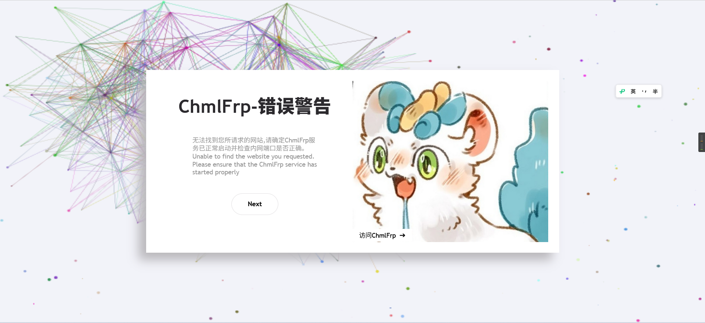
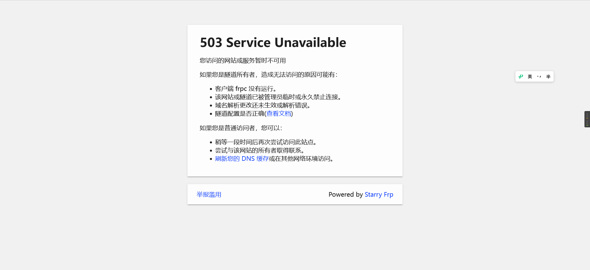
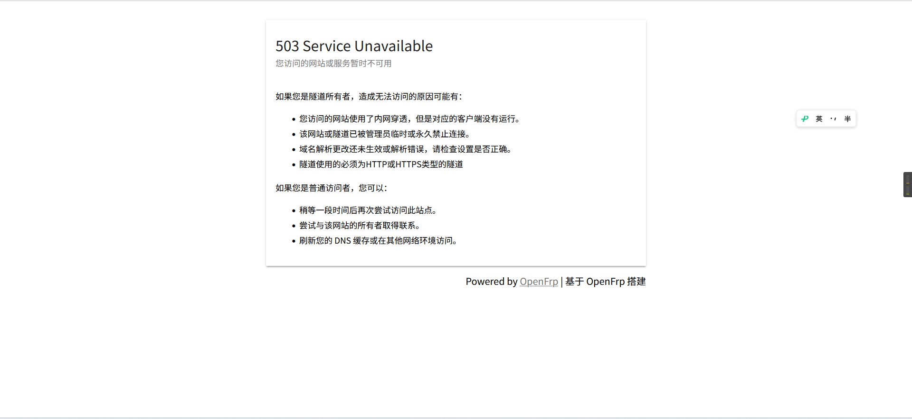

# 网站访问问题
## 找不到站点
::: details 报错信息
  
  
  
  

:::
这是因为客户端的请求协议是`HTTP`，但我们的隧道类型是`HTTPS`，所以只要将协议头改成`https`就可以了。
::: note 实例
http://class.xuanxuan1231.tk -> https://class.xuanxuan1231.tk
:::

## 引申：服务器发送了无效的响应
错误：`SSL_ERROR_RX_RECORD_TOO_LONG`（FireFox）、`ERR_SSL_PROTOCOL_ERROR`（Chromium 内核 Edge）
遇到这个问题，请您**一定一定**要**联系网站管理员**！
遇到这个问题，请您**一定一定**要**联系网站管理员**！
遇到这个问题，请您**一定一定**要**联系网站管理员**！

# 网站使用问题
## 论坛使用 Casdoor 时出现`加载页面时出错，请检查控制台。`
直到现在，论坛的单点登录还不能正常运行。我们建议您直接注册。

## 哪里可以实时看到网站状态？
[状态监测站](https://status.xuanxuan1231.tk)

## 其他问题
可以发邮件到[wenxuan@xuanxuan1231.tk](mailto:wenxuan@xuanxuan1231.tk)或微信联系我们。